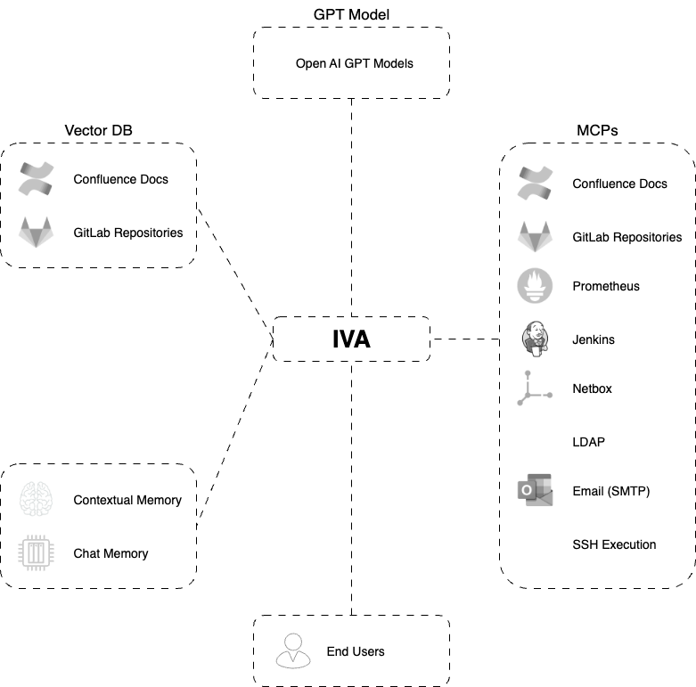

# IVA — InfraOps Virtual Assistant

**IVA** is an AI-powered automation agent built to assist infrastructure teams with routine operations, observability, and system orchestration tasks. It leverages Docker-based services, workflows via `n8n`, and integrations through APIs to streamline DevOps workflows.

---

## 🧰 Features

- 🔄 Workflow automation with **n8n**
- 📊 Integrated observability tools
- ⚙️ Self-hosted with Docker Compose
- 🧠 AI-enhanced commands and monitoring
- 🔐 Secure access via NGINX Proxy Manager
- 📂 Infra management via **Portainer**
- 🛠️ API server for remote command execution

---

## 🏗️ Architecture

This project is containerized and orchestrated using Docker Compose. It includes:

- **NGINX Proxy Manager** for routing and TLS management
- **n8n** for workflow automation
- **PostgreSQL** for storing n8n data
- **Portainer** for managing containers via GUI
- **SSH API Server** to execute system-level commands securely




---

## 📦 Services (From `docker-compose.yml`)

| Service           | Description                          | Port(s)          |
|-------------------|--------------------------------------|------------------|
| `infra-proxy`     | NGINX Proxy Manager                  | 80, 81, 443      |
| `infra-portainer` | Portainer CE for Docker UI          | -                |
| `infra-workflow`  | n8n Automation Tool                 | -                |
| `infra-workflow-db` | PostgreSQL DB for n8n             | 5432             |
| `infra-memory-db`  | In-memory store for agent memory (e.g., Redis)          | -       |
| `infra-qdrant-db`  | Qdrant vector DB for LLM context storage                | -       |
| `infra-open-webui` | Web-based LLM chat interface (like OpenChat/Open WebUI) | -       |

---

## 🧪 n8n Workflows Summary

### 🔁 IVA x1
Acts as the central AI automation hub.
- Webhook, chat trigger, and OpenAI LLM integration
- Prometheus, Confluence, LDAP, Email, Netbox via MCP tools
- Vector store and internal reasoning

### 📈 IVA: Prometheus MCP
Fetches Prometheus metrics via HTTP when triggered.

### 📚 IVA: Confluence MCP
Retrieves and creates Confluence pages using API calls.

### 📧 IVA: Email MCP
Sends email alerts/notifications triggered by events.

### 👥 IVA: LDAP MCP
LDAP user lookups including email, name, DN, and SAM account.

### 💻 IVA: SSH MCP
Executes commands remotely via SSH endpoint integration.

### 🧮 IVA: Netbox MCP
Fetches inventory and network metadata from NetBox.

### 🏗️ IVA: Jenkins MCP
Triggers Jenkins jobs, gets job parameters and Crumb token.

### 💻 IVA: GitLab MCP
Reads/writes GitLab files and creates repos programmatically.

### 🧠 IVA Vectorization
Transforms and batches input data, then vectorizes for AI search.

---


## 🧠 Prerequisites

Before running IVA, ensure you have the following:

### System Requirements
- Docker & Docker Compose installed
- Internet access for pulling images
- Unix-based host (tested on Ubuntu)

### Knowledge Requirements
- Familiarity with Docker and containers
- Basic understanding of DevOps and infrastructure tools (e.g., Prometheus, LDAP, Netbox, Jenkins, GitLab)
- n8n automation concepts (nodes, workflows, triggers)
- Familiarity with Openweb UI to compifure and Import PIPE Function

---

## 🚀 Getting Started

1. **Clone the repo**
   ```bash
   git clone <your-repo-url>
   cd iva
   ```

2. **Start the stack**
   ```bash
   docker-compose up -d
   ```

3. **Expose Services(Nginx)**

After starting the stack, you'll need to manually **add entries in NGINX Proxy Manager** for these core services:

| Service         | Purpose                                  | Suggested Hostname       | Port                         |
| --------------- | ---------------------------------------- | ------------------------ | ---------------------------- |
| **n8n**         | Workflow automation UI                   | `workflow.yourcompany.com`     | `5678` (or exposed port)|
| **Qdrant**      | Vector database for AI memory embeddings | `vector.yourcompany.com`  | `6333` (or internal port)    |
| **Open WebUI**  | Chat interface for AI agents             | `chat.yourcompany.com`    | default exposed by container |

> 🔐 **Tip:** Use NGINX Proxy Manager to configure HTTPS with Let's Encrypt, and optionally secure each endpoint with authentication.

4. **Import n8n Workflows**
   - Go to `n8n` UI
   - Use the import button to load all `.json` files from `n8n-resources/`
   - Ensure each workflow is activated if needed

5. **Add Required Credentials in n8n**
   - Configure the following credentials manually in the UI:
     - HTTP Request Auth (for Confluence, GitLab, Jenkins, etc.)
     - LDAP Auth (LDAP MCP)
     - Email SMTP credentials
     - SSH endpoint config (via API server)
     - Qdrant/Vector store connection

---

## 📂 File Structure

```
iva/
├── docker-compose.yml
├── commands.sh
├── ssh-api-server/
│   └── .gitignore
├── n8n-resources/
│   ├── IVA x1.json
│   └── MCP Servers/
├── openwebui-resources/
│   └── function-iva_x1.json
└── ...
```

---

## 🛡️ Security & Access

- Ensure the credentials are configured securely.
- HTTPS is managed via NGINX Proxy + Let's Encrypt.
- API access should be authenticated and rate-limited in production.

---

## 📄 License

MIT
